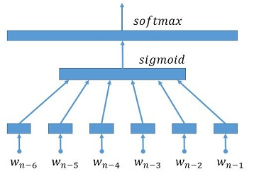

# 中文词向量模型的使用 #
----------
本文档介绍如何在PaddlePaddle平台上,使用预训练的标准格式词向量模型。

在此感谢 @lipeng 提出的代码需求，并给出的相关模型格式的定义。

## 介绍 ###
### 中文字典 ###
我们的字典使用内部的分词工具对百度知道和百度百科的语料进行分词后产生。分词风格如下： "《红楼梦》"将被分为 "《"，"红楼梦"，"》"，和 "《红楼梦》"。字典采用UTF8编码，输出有2列：词本身和词频。字典共包含 3206325个词和3个特殊标记：
  - `<s>`: 分词序列的开始
  - `<e>`: 分词序列的结束
  - `<unk>`: 未知词

### 中文词向量的预训练模型 ###
遵循文章 [A Neural Probabilistic Language Model](http://www.jmlr.org/papers/volume3/bengio03a/bengio03a.pdf)中介绍的方法，模型采用 n-gram 语言模型，结构如下图：6元上下文作为输入层->全连接层->softmax层 。对应于字典，我们预训练得到4种不同维度的词向量，分别为：32维、64维、128维和256维。

Figure 1. neural-n-gram-model

### 下载和数据抽取 ###
运行以下的命令下载和获取我们的字典和预训练模型：

    cd $PADDLE_ROOT/demo/model_zoo/embedding
    ./pre_DictAndModel.sh

## 中文短语改写的例子 ##
以下示范如何使用预训练的中文字典和词向量进行短语改写。

### 数据的准备和预处理 ###
首先，运行以下的命令下载数据集。该数据集（utf8编码）包含20个训练样例，5个测试样例和2个生成式样例。

    cd $PADDLE_ROOT/demo/seqToseq/data
    ./paraphrase_data.sh

第二步，将数据处理成规范格式，在训练数集上训练生成词向量字典（数据将保存在 `$PADDLE_SOURCE_ROOT/demo/seqToseq/data/pre-paraphrase`）:

    cd $PADDLE_ROOT/demo/seqToseq/
    python preprocess.py -i data/paraphrase [--mergeDict]

- 其中，如果使用`--mergeDict`选项，源语言短语和目标语言短语的字典将被合并（源语言和目标语言共享相同的编码字典）。本实例中，源语言和目标语言都是相同的语言，因此可以使用该选项。

### 使用用户指定的词向量字典 ###
使用如下命令，从预训练模型中，根据用户指定的字典，抽取对应的词向量构成新的词表
    cd $PADDLE_ROOT/demo/model_zoo/embedding
    python extract_para.py --preModel PREMODEL --preDict PREDICT --usrModel USRMODEL--usrDict USRDICT -d DIM

- `--preModel PREMODEL`: 预训练词向量字典模型的路径
- `--preDict PREDICT`:  预训练模型使用的字典的路径
- `--usrModel USRMODEL`: （抽取出的新词表的保存路径
- `--usrDict USRDICT`: 用户指定新的字典的路径，用于构成新的词表
- `-d DIM`: 参数（词向量）的维度

此处，你也可以简单的运行以下的命令：

    cd $PADDLE_ROOT/demo/seqToseq/data/
    ./paraphrase_model.sh

运行成功以后，你将会看到以下的模型结构：

    paraphrase_model
    |--- _source_language_embedding
    |--- _target_language_embedding

### 在PaddlePaddle平台训练模型 ###
首先，配置模型文件，配置如下（可以参考保存在 `demo/seqToseq/paraphrase/train.conf`的配置）:

    from seqToseq_net import *
    is_generating = False

    ################## Data Definition #####################
    train_conf = seq_to_seq_data(data_dir = "./data/pre-paraphrase",
                                 job_mode = job_mode)

    ############## Algorithm Configuration ##################
    settings(
          learning_method = AdamOptimizer(),
          batch_size = 50,
          learning_rate = 5e-4)

    ################# Network configure #####################
    gru_encoder_decoder(train_conf, is_generating, word_vector_dim = 32)

这个配置与`demo/seqToseq/translation/train.conf` 基本相同

然后，使用以下命令进行模型训练:

    cd $PADDLE_SOURCE_ROOT/demo/seqToseq/paraphrase
    ./train.sh

其中，`train.sh` 与`demo/seqToseq/translation/train.sh` 基本相同，只有2个配置不一样:

- `--init_model_path`: 初始化模型的路径配置为`data/paraphrase_modeldata/paraphrase_model`
- `--load_missing_parameter_strategy`:除词向量模型外的参数将使用正态分布” 改为 “除词向量模型外的参数将使用正态分布随机初始化

如果用户想要了解详细的数据集的格式、模型的结构和训练过程，请查看 [Text generation Tutorial](../text_generation/text_generation.md).

## 可选功能 ##
###  观测词向量
PaddlePaddle 平台为想观测词向量的用户提供了将二进制词向量模型转换为文本模型的功能:

    cd $PADDLE_ROOT/demo/model_zoo/embedding
    python paraconvert.py --b2t -i INPUT -o OUTPUT -d DIM

- `-i INPUT`: 输入的（二进制）词向量模型名称
- `-o OUTPUT`: 输出的文本模型名称
- `-d DIM`: （词向量）参数维度

运行完以上命令，用户可以在输出的文本模型中看到:

    0,4,32156096
    -0.7845433,1.1937413,-0.1704215,0.4154715,0.9566584,-0.5558153,-0.2503305, ......
    0.0000909,0.0009465,-0.0008813,-0.0008428,0.0007879,0.0000183,0.0001984, ......
    ......

- 其中，第一行是`PaddlePaddle` 输出文件的格式说明，包含3个属性：:
  - `PaddlePaddle`的版本号，本例中为0
  - 浮点数占用的字节数，本例中为4
  - 总计的参数个数，本例中为32,156,096
- 其余行是（词向量）参数行（假设词向量维度为32）
  - 每行打印32个参数以','分隔
  - 共有32,156,096/32 = 1,004,877行，也就是说，模型共包含1,004,877个被向量化的词

### 词向量模型的修正
`PaddlePaddle` 为想修正词向量模型的用户提供了将文本词向量模型转换为二进制模型的命令:

    cd $PADDLE_ROOT/demo/model_zoo/embedding
    python paraconvert.py --t2b -i INPUT -o OUTPUT

- `-i INPUT`: 输入的文本词向量模型名称
- `-o OUTPUT`: 输出的二进制词向量模型名称

请注意，输入的文本格式如下:

    -0.7845433,1.1937413,-0.1704215,0.4154715,0.9566584,-0.5558153,-0.2503305, ......
    0.0000909,0.0009465,-0.0008813,-0.0008428,0.0007879,0.0000183,0.0001984, ......
    ......
- 输入文本中没有头部（格式说明）行
- （输入文本）每行存储一个词，以逗号','分隔
