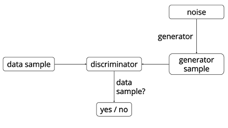
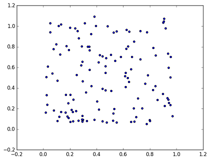
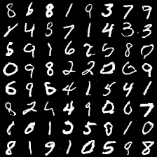

# Generative Adversarial Networks (GAN) 

This demo implements GAN training described in the original GAN paper (https://arxiv.org/abs/1406.2661) and DCGAN (https://arxiv.org/abs/1511.06434).

The high-level structure of GAN is shown in Figure. 1 below. It is composed of two major parts: a generator and a discriminator, both of which are based on neural networks. The generator takes in some kind of noise with a known distribution and transforms it into an image. The discriminator takes in an image and determines whether it is artificially generated by the generator or a real image. So the generator and the discriminator are in a competitive game in which generator is trying to generate image to look as real as possible to fool the discriminator, while the discriminator is trying to distinguish between real and fake images. 

<center></center>
<center>Figure 1. GAN-Model-Structure</center>

The generator and discriminator take turn to be trained using SGD. The objective function of the generator is for its generated images being classified as real by the discriminator, and the objective function of the discriminator is to correctly classify real and fake images. When the GAN model is trained to converge to the equilibrium state, the generator will transform the given noise distribution to the distribution of real images, and the discriminator will not be able to distinguish between real and fake images at all. 

## Implementation of GAN Model Structure
Since GAN model involves multiple neural networks, it requires to use paddle python API. So the code walk-through below can also partially serve as an introduction to the usage of Paddle Python API.

There are three networks defined in gan_conf.py, namely generator_training, discriminator_training and generator. The relationship to the model structure we defined above is that discriminator_training is the discriminator, generator is the generator, and the generator_training combined the generator and discriminator since training generator would require the discriminator to provide loss function. This relationship is described in the following code
```python
if is_generator_training:
    noise = data_layer(name="noise", size=noise_dim)
    sample = generator(noise)

if is_discriminator_training:
    sample = data_layer(name="sample", size=sample_dim)

if is_generator_training or is_discriminator_training:
    label = data_layer(name="label", size=1)
    prob = discriminator(sample)
    cost = cross_entropy(input=prob, label=label)
    classification_error_evaluator(
        input=prob, label=label, name=mode + '_error')
    outputs(cost)

if is_generator:
    noise = data_layer(name="noise", size=noise_dim)
    outputs(generator(noise))
```

In order to train the networks defined in gan_conf.py, one first needs to initialize a Paddle environment, parse the config, create GradientMachine from the config and create trainer from GradientMachine as done in the code chunk below.
```python
import py_paddle.swig_paddle as api
# init paddle environment
api.initPaddle('--use_gpu=' + use_gpu, '--dot_period=10',
               '--log_period=100', '--gpu_id=' + args.gpu_id,
               '--save_dir=' + "./%s_params/" % data_source)

# Parse config
gen_conf = parse_config(conf, "mode=generator_training,data=" + data_source)
dis_conf = parse_config(conf, "mode=discriminator_training,data=" + data_source)
generator_conf = parse_config(conf, "mode=generator,data=" + data_source)

# Create GradientMachine
dis_training_machine = api.GradientMachine.createFromConfigProto(
dis_conf.model_config)
gen_training_machine = api.GradientMachine.createFromConfigProto(
gen_conf.model_config)
generator_machine = api.GradientMachine.createFromConfigProto(
generator_conf.model_config)

# Create trainer
dis_trainer = api.Trainer.create(dis_conf, dis_training_machine)
gen_trainer = api.Trainer.create(gen_conf, gen_training_machine)
```

In order to balance the strength between generator and discriminator, we schedule to train whichever one is performing worse by comparing their loss function value. The loss function value can be calculated by a forward pass through the GradientMachine
```python
def get_training_loss(training_machine, inputs):
    outputs = api.Arguments.createArguments(0)
    training_machine.forward(inputs, outputs, api.PASS_TEST)
    loss = outputs.getSlotValue(0).copyToNumpyMat()
    return numpy.mean(loss)
```

After training one network, one needs to sync the new parameters to the other networks. The code below demonstrates one example of such use case.
```python
# Train the gen_training
gen_trainer.trainOneDataBatch(batch_size, data_batch_gen)

# Copy the parameters from gen_training to dis_training and generator
copy_shared_parameters(gen_training_machine,
dis_training_machine)
copy_shared_parameters(gen_training_machine, generator_machine)
```


## A Toy Example 
With the infrastructure explained above, we can now walk you through a toy example of generating two dimensional uniform distribution using 10 dimensional Gaussian noise. 

The Gaussian noises are generated using the code below
```python
def get_noise(batch_size, noise_dim):
    return numpy.random.normal(size=(batch_size, noise_dim)).astype('float32')
```

The real samples (2-D uniform) are generated using the code below
```python
# synthesize 2-D uniform data in gan_trainer.py:114
def load_uniform_data():
    data = numpy.random.rand(1000000, 2).astype('float32')
    return data
```

The generator and discriminator network are built using fully-connected layer and batch_norm layer, and are defined in gan_conf.py. 

To train the GAN model, one can use the command below. The flag -d specifies the training data (cifar, mnist or uniform) and flag --useGpu specifies whether to use gpu for training (0 is cpu, 1 is gpu).  
```bash
$python gan_trainer.py -d uniform --useGpu 1
```
The generated samples can be found in ./uniform_samples/ and one example is shown below as Figure 2. One can see that it roughly recovers the 2D uniform distribution. 

<center></center>
<center>Figure 2. Uniform Sample</center>

## MNIST Example
### Data preparation
To download the MNIST data, one can use the following commands.
```bash
$cd data/
$./get_mnist_data.sh
```

### Model description
Following the DC-Gan paper (https://arxiv.org/abs/1511.06434), we use convolution/convolution-transpose layer in the discriminator/generator network to better deal with images. The details of the network structures are defined in gan_conf_image.py. 

### Training the model
To train the GAN model on mnist data, one can use the following command
```bash
$python gan_trainer.py -d mnist --useGpu 1
```
The generated sample images can be found at ./mnist_samples/ and one example is shown below as Figure 3. 
<center></center>
<center>Figure 2. MNIST Sample</center>
